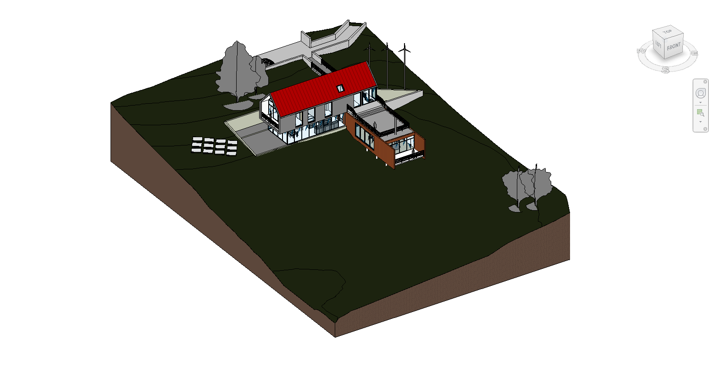
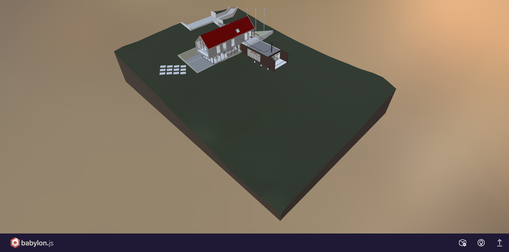
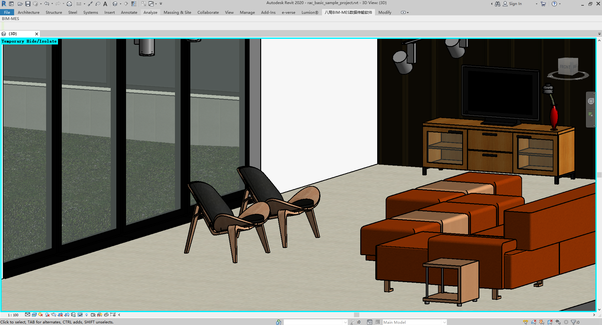
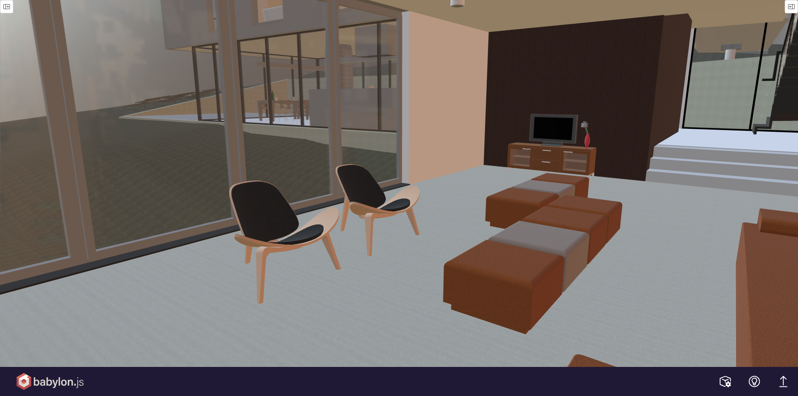

# RevitTrueGltf 

RevitTrueGltf is a high-fidelity Revit to glTF 2.0 exporter plugin. It is dedicated to reproducing the original models and materials from Revit as accurately as possible in 3D graphics applications through a Physically Based Rendering (PBR) workflow to achieve high-quality rendering results.

## 1. Project Introduction

The primary goal of this project is to solve the common issues of material information loss and visual distortion when exporting from Revit to glTF. Whether it's standard architectural materials or complex transmissive glass, RevitTrueGltf deeply extracts the data and accurately expresses it in the resulting glTF file.

### Visual Comparison (Revit vs glTF)

*(Note: The actual rendering appearance in Revit varies significantly depending on the selected **Visual Style** (e.g., Shaded vs. Realistic). RevitTrueGltf exports physically based properties to closely match Revit's high-fidelity **Realistic** or rendered outputs.)*

| Revit Internal Rendering | RevitTrueGltf Export (e.g., in Babylon.js) |
| :---: | :---: |
| **Exterior View**  | **Exterior View**  |
| **Interior View**  | **Interior View**  |

## 2. Supported Revit Versions

By configuring Multi-Targeting Frameworks, the project natively supports a wide range of Revit versions.

| Revit Version | Compiled Target | Tested |
| :---: | :---: | :---: |
| **2020** | ✔️ | ✔️ |
| **2021** | ✔️ | - |
| **2022** | ✔️ | - |
| **2023** | ✔️ | - |
| **2024** | ✔️ | - |
| **2025** | ✔️ | - |
| **2026** | ✔️ | - |

## 3. Supported Exported PBR Information

In terms of material conversion, the exporter deeply analyzes Revit's internal material assets and maps them to glTF 2.0 PBR material extensions.

- **Base Color (Albedo)**: Extracted directly from Revit's generic or specific materials, including base texture maps and tints.
- **Metallic & Roughness**: Fully supports the standardized PBR Metallic-Roughness workflow, reliably restoring the reflection and roughness characteristics of material surfaces.
- **Normal Maps (Converted from Bump)**: Because Revit internally uses grayscale Bump Maps, the plugin features a high-performance, zero-allocation algorithm to dynamically convert them into standard Tangent-Space Normal Maps. This ensures correct bump mapping and surface detail in standard rendering engines.
- **Glazing / Transmissive Materials**: Specifically targets Revit's glazing material classes. It uses the `KHR_materials_transmission` extension for physically accurate glass. This correctly exports **Transmission** (light passthrough), **Index of Refraction (IOR)**, and **Volume** properties. It also implements a standard Alpha Blending fallback for simpler renderer compatibility.
- **Transparency / Opacity**: Extracts and configures proper blending modes and alpha cutoffs based on the source Revit material setup.

### Detailed Material Property Support Matrix

| Material Property / Feature | Supported | Planned (Roadmap) |
| :--- | :---: | :---: |
| **Base Color / Tint / Albedo Texture** | ✔️ | - |
| **Metallic & Roughness** | ✔️ | - |
| **Grayscale Bump to Normal Map** | ✔️ | - |
| **Glazing (Transmission, IOR, Volume)** | ✔️ | - |
| **Transparency (Alpha Blend / Cutoff)** | ✔️ | - |
| **Emissive (Self-Illumination)** | - | - |
| **Revit Decals** | - | - |
| **Procedural Maps (Wood, Marble, etc.)** | - | - |
| **Advanced Texture Transform (UV Offset/Scale)**| - | - |

## 4. Open-Source Projects Used

The successful build of this plugin relies on the following excellent open-source libraries. We highly appreciate their contributions:

- **[SharpGLTF](https://github.com/vpenades/SharpGLTF)** (`SharpGLTF.Core` and `SharpGLTF.Toolkit`): An outstanding glTF/glb read-write framework. This project heavily utilizes it to construct the scene graph, manage materials, and serialize the standard-compliant glTF binaries.
- **[ImageSharp](https://github.com/SixLabors/ImageSharp)** (`SixLabors.ImageSharp`): A cross-platform, high-performance image processing library. It handles the critical background texture modifications, in particular mapping and regenerating pixels for the Bump Map to Normal Map process.

## 5. Contributing & Feedback

We warmly welcome all forms of contributions to make RevitTrueGltf better! 

If you have any suggestions, feature requests (such as supporting more Revit material types), or encounter any bugs, please feel free to:
- Open an **Issue** to discuss your ideas or report problems.
- Submit a **Pull Request (PR)** if you are interested in joining the development and contributing directly to the codebase.

Let's build a better, high-fidelity Revit-to-glTF exporter together!
