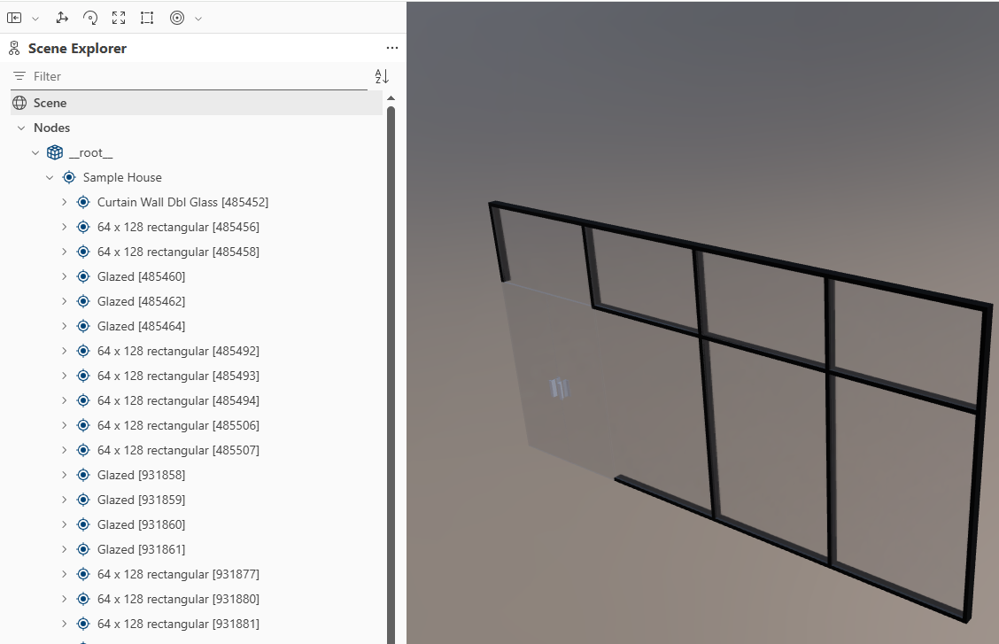
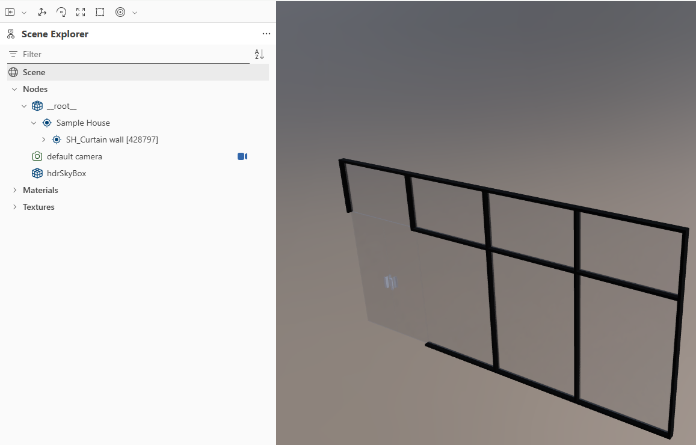

<h1 align="center">
  
   
  RevitTrueGltf
</h1>

RevitTrueGltf is an advanced Revit to glTF 2.0 exporter plugin built for both high-fidelity rendering and full BIM data integration. It faithfully preserves PBR materials and complete element parameters, bridging the gap between Revit authoring and modern 3D engines (e.g., Babylon.js, Three.js) for Digital Twins and O&M workflows.

## 1. Project Introduction

Exporting from Revit to standard 3D formats has long suffered from material distortion, lost transparency, and stripped metadata. RevitTrueGltf addresses all three: it deeply extracts physical material properties (including complex transmissive glass via `KHR_materials_transmission`) and provides flexible BIM data export strategies—Flat Embedded JSON, Shared Schemas, or standalone SQLite databases—so your models arrive in the target engine both visually faithful and structurally data-rich.

### Visual Comparison (Revit vs glTF)

*(Note: The actual rendering appearance in Revit varies significantly depending on the selected **Visual Style** (e.g., Shaded vs. Realistic). RevitTrueGltf exports physically based properties to closely match Revit's high-fidelity **Realistic** or rendered outputs.)*

| Revit Internal Rendering | RevitTrueGltf Export (e.g., in Babylon.js) |
| :---: | :---: |
| **Exterior View**  | **Exterior View**  |
| **Interior View**  | **Interior View**  |

## 2. Supported Revit Versions

By configuring Multi-Targeting Frameworks, the project natively supports a wide range of Revit versions.

| Revit Version | Compiled Target | Tested |
| :---: | :---: | :---: |
| **2020** | ✔️ | ✔️ |
| **2021** | ✔️ | - |
| **2022** | ✔️ | - |
| **2023** | ✔️ | - |
| **2024** | ✔️ | - |
| **2025** | ✔️ | - |
| **2026** | ✔️ | - |

## 3. Supported Exported PBR Information

In terms of material conversion, the exporter deeply analyzes Revit's internal material assets and maps them to glTF 2.0 PBR material extensions.

- **Base Color (Albedo)**: Extracted directly from Revit's generic or specific materials, including base texture maps and tints.
- **Metallic & Roughness**: Fully supports the standardized PBR Metallic-Roughness workflow, reliably restoring the reflection and roughness characteristics of material surfaces.
- **Normal Maps (Converted from Bump)**: Because Revit internally uses grayscale Bump Maps, the plugin features a high-performance, zero-allocation algorithm to dynamically convert them into standard Tangent-Space Normal Maps. This ensures correct bump mapping and surface detail in standard rendering engines.
- **Glazing / Transmissive Materials**: Specifically targets Revit's glazing material classes. It uses the `KHR_materials_transmission` extension for physically accurate glass. This correctly exports **Transmission** (light passthrough), **Index of Refraction (IOR)**, and **Volume** properties. It also implements a standard Alpha Blending fallback for simpler renderer compatibility.
- **Transparency / Opacity**: Extracts and configures proper blending modes and alpha cutoffs based on the source Revit material setup.
- **Revit Parameters**: Extracts original Revit parameters (Identity Data, Dimensions, Project Info) and provides three distinct export modes to suit different application scenarios:
    - **Flat Embedded**: Directly embeds parameter data into each glTF node's `extras`. This is the most compatible mode for standard glTF viewers and is ideal for **prototyping and rapid development validation**, as metadata can be inspected immediately without additional processing.
    - **Schema Referenced**: Stores a global parameter schema at the root and uses indexed references for each element. This significantly reduces redundancy and file size for large-scale models.
    - **External SQLite**: Exports parameter data into a standalone `.sqlite` database companion file. This is the professional choice for **Operation & Maintenance (O&M)** systems, allowing for flexible post-processing, data transformation, and real-time backend updates without modifying the 3D model itself.

- **Logical Element Hierarchy**: Reconstructs the full Revit logical structure (Curtain Walls, Groups, Nested Families) within the glTF scene graph. 
    - **BIM & O&M Ready**: Parameters attach to logical parents, ensuring data integrity for asset management and Digital Twins.

    | Before (Flat Mesh) | After (Logic Tree) |
    | :---: | :---: |
    |  |  |

### Detailed Material & Data Support Matrix

| Material Property / Feature | Supported | Planned (Roadmap) |
| :--- | :---: | :---: |
| **Base Color / Tint / Albedo Texture** | ✔️ | - |
| **Metallic & Roughness** | ✔️ | - |
| **Grayscale Bump to Normal Map** | ✔️ | - |
| **Glazing (Transmission, IOR, Volume)** | ✔️ | - |
| **Transparency (Alpha Blend / Cutoff)** | ✔️ | - |
| **Emissive (Self-Illumination)** | - | - |
| **Revit Decals** | - | - |
| **Procedural Maps (Wood, Marble, etc.)** | - | - |
| **Advanced Texture Transform (UV Offset/Scale)**| - | - |
| **Basis Universal (KTX2) Texture Compression** | ✔️ | - |
| **Draco Geometry Compression** | - | - |
| **Meshoptimizer Support** | ✔️ | - |
| **Extract Revit parameters** | ✔️ | - |
| **Level Export & Element-Level Association** | ✔️ | - |

## 4. How to Install & Test

Since there is currently no pre-built `.msi` installer, you can load the plugin into Revit manually. Setting it up involves 3 simple steps:

### Step 1: Obtain the Plugin Files (Choose one method)
You can get the required `.dll` and `.addin` template files in two ways:

**Method A: Download Pre-compiled Release (For general users)**
1. Go to the **Releases** page of this repository.
2. Download the pre-compiled `.zip` file for your target Revit version.
3. Extract the contents into a local folder.

**Method B: Compile from Source (For developers)**
1. Open `RevitTrueGltf.sln` in Visual Studio.
2. Build the project for your target Revit version (e.g., `Debug2024` or `Release2024`). The compiled `RevitTrueGltf.dll` will be generated in your output directory (e.g., `bin/2024/`).
3. Locate the template `RevitTrueGltf.addin` file at the root of this repository.

### Step 2: Configure the `.addin` File
Once you have the `.dll` and `.addin` files from Step 1:
1. Open the `.addin` file with any text editor (like Notepad).
2. Find the `<Assembly>` tag line.
3. Replace the placeholder text with the **absolute path** to your `RevitTrueGltf.dll` (e.g., `<Assembly>D:\RevitTrueGltf\RevitTrueGltf.dll</Assembly>`). 
4. Save the file.

### Step 3: Install and Run in Revit
1. **Copy the edited `.addin` file** into one of the standard Revit plugin directories for your target version (e.g., `2024`). Common paths include:
   - **Current User (Testing):** `%AppData%\Autodesk\Revit\Addins\<Year>` (e.g., `C:\Users\<YourUsername>\AppData\Roaming\Autodesk\Revit\Addins\2024`)
   - **All Users (Global):** `%ProgramData%\Autodesk\Revit\Addins\<Year>` (e.g., `C:\ProgramData\Autodesk\Revit\Addins\2024`)
2. **Launch Revit** and open a 3D view. 
3. Go to the **Add-Ins > External Tools** ribbon and click **Export True glTF**.

## 5. Open-Source Projects Used

The successful build of this plugin relies on the following excellent open-source libraries. We highly appreciate their contributions:

- **[SharpGLTF](https://github.com/vpenades/SharpGLTF)** (`SharpGLTF.Core` and `SharpGLTF.Toolkit`): An outstanding glTF/glb read-write framework. This project heavily utilizes it to construct the scene graph, manage materials, and serialize the standard-compliant glTF binaries.
- **[ImageSharp](https://github.com/SixLabors/ImageSharp)** (`SixLabors.ImageSharp`): A cross-platform, high-performance image processing library. It handles the critical background texture modifications, in particular mapping and regenerating pixels for the Bump Map to Normal Map process.

## 6. Contributing & Feedback

We warmly welcome all forms of contributions to make RevitTrueGltf better! 

If you have any suggestions, feature requests (such as supporting more Revit material types), or encounter any bugs, please feel free to:
- Open an **Issue** to discuss your ideas or report problems.
- Submit a **Pull Request (PR)** if you are interested in joining the development and contributing directly to the codebase.

Let's build a better, high-fidelity Revit-to-glTF exporter together!
